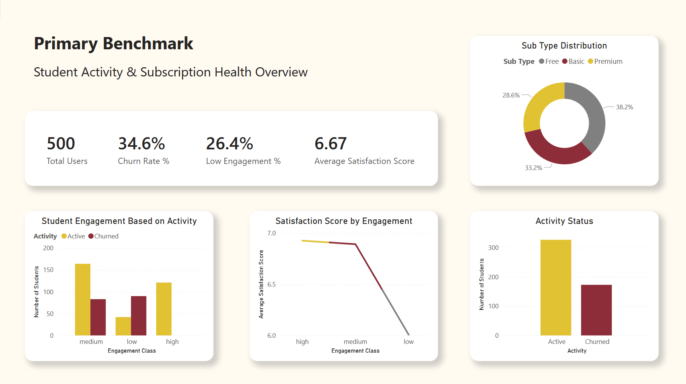
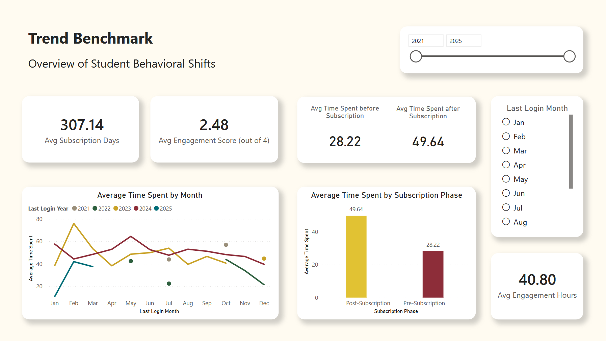

# ✈ Student Engagement Analysis

*A Business & Data Analytics Case Study*

---

## Dataset Overview

* **Records:** 500
* **Features:** 9
* **Source:** Kaggle [Edtech Engagement Data](https://www.kaggle.com/datasets/maggieakarn/edtech-engagement-data?select=Engagement+Data++.csv)

---

## 🔍 Project Overview

This project analyzes **student engagement behavior** and its relationship with **subscription conversion, retention, and churn** in an EdTech-style platform.

The goal is **not just visualization**, but to:

- Define **clear engagement benchmarks**

- Track **engagement trends over time**

- Translate insights into **business recommendations**


---

## 🗂 Repository Structure

```
student_engagement_analysis/
│
├── dashboard/
│   ├── dax_&_measures.md
│   └── student_engagement_analysis.pbix
│
├── images/
│   ├── PrimaryBenchmark.png
│   └── TrendBenchmark.png
│
├── data/
│   ├── raw/
│   │   ├── engagement_data.csv
│   │   ├── student_data.csv
│   │   └── subscription_data.csv
│   │
│   └── processed/
│       ├── student_engagement_master_table.xlsx
│       └── column_definitions.md
│
└── reports/
          ├── insights_and_recommendations.md
          ├── dashboard.pdf
          └── student_engagement_analysis_presentation.pptx

```

---

## 🧩 Tools Used

- **Power BI** – Dashboarding & DAX

- **Microsoft Excel** – Data cleaning & validation

---

## 👉🏻 The Main Stuff

- [**Power BI Dashboard**](dashboard/student_engagement_analysis.pbix)

- [**Key Insights and Recommendations**](reports/insights_and_recommendations.md)

---

## 📊 Dashboard Preview

*(Snapshot only — full interactivity available in Power BI file)*



